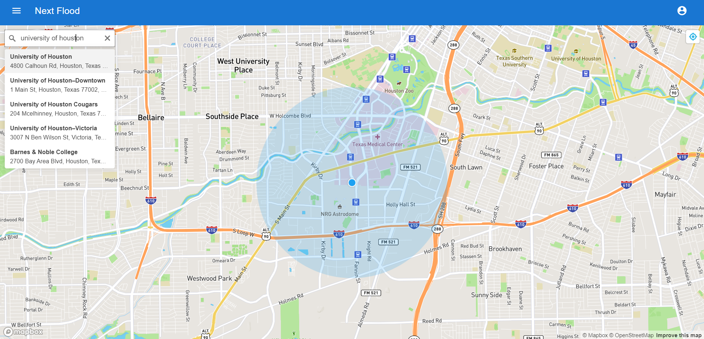

# NextFlood-COSC-4353



## What is NextFlood?

For the community, real estate and insurance companies, and any Houstonian who needs immediate information about overflowing and critical high-level water in our neighborhoods and localities, the NextFlood is a web application that will help the population be up to date to the second with the floods due to hurricanes and tropical storms that affect us every year. Unlike the Red Cross Flood App, or other apps like FloodWatch, our product is crowd sourced. Users will be able to post geotagged videos, photos, and texts that automatically will be added to our map allowing other users to make independent decisions safely and navigate in response to the flood in real-time increasing the protection of citizens and their belongings.

## Team Members

1. Hardith Suvarna Murari
2. Rajath Puttaswamy Gowda
3. Sampath Babu Nuthalapati

## Tech Stack

React :electron:

ASP.Net Core Web API :steam_locomotive:

MySQL :key:

AWS :rocket:

#### Folder structure

```sh
NextFlood-COSC-4353/
├── API        
├── DB
├── UI              # Front End
├── Features.md     # List of main functionalities
├── lexicon.md      # Project related vocabulary
├── classes.txt     # List of classes to be implemented
```

## Database file (mySQL)

It is named sqlQueriesNextFlood.sql and it's located in the DB folder of the root folder

## Branching :octocat:

> We create branches so we can work at the same time and then we merge those branches with the main one

1. `git branch {your-branch-name}`
2. `git checkout {your-branch-name}`
3. `git push --set-upstream origin {your-branch-name}`

## To push your work to the shared repo run in the root folder. 

> Never push if you haven't pull the latest code and solve the merging conflicts locally if any

1. `git add .`
2. `git commit -m "Your message, what you did in the code"`
3. `git push`

## To pull from master

> Always pull before starting to work for the day, or first verify that you have the latest code
> Make sure to know your origin

1. `git pull origin main`

## How to open a pull request

> Pull requests or PRs are basically how you merge your changes with the master code. They will be revised by a member of the group and that member will post comments on your code and ask you to fix those.

1. Once you push your code you will see a green message saying if you want to create a pull request. Always do a pull request to the main branch. Do not delete your own branch as you will continue to use it.
2. You can also click on Pull Request and open one there.
